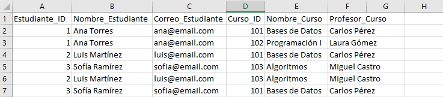
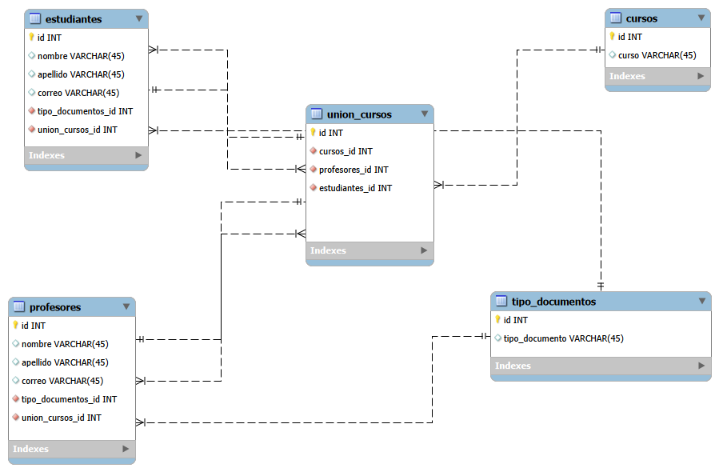

# normalizacion

Aquí veremos a continuacion el procedimiento para normalizar tablas en MySQL Workbench

## Tabla #1

Esta es la tabla para aplicar la **Normalizacion**.\
Como podemos ver en la tabla tiene datos los cuales estan en una **sola columna** cuando podria dividirse para que sea mas organizada. 

## Normalizacion de la tabla #1

