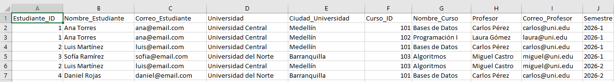
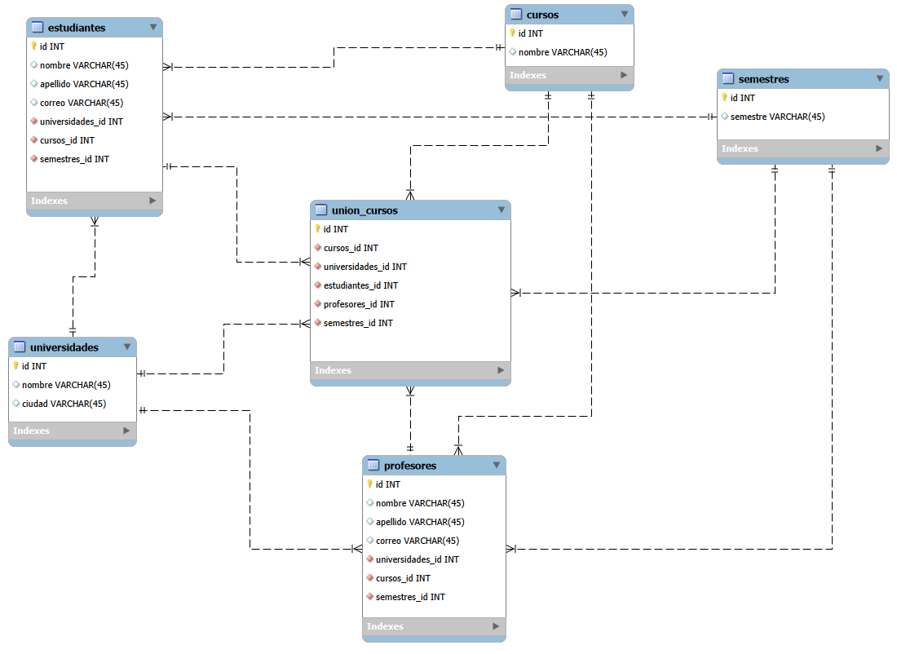
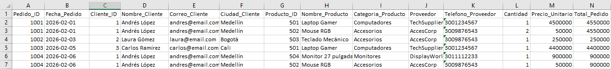
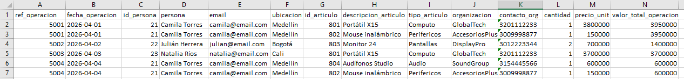
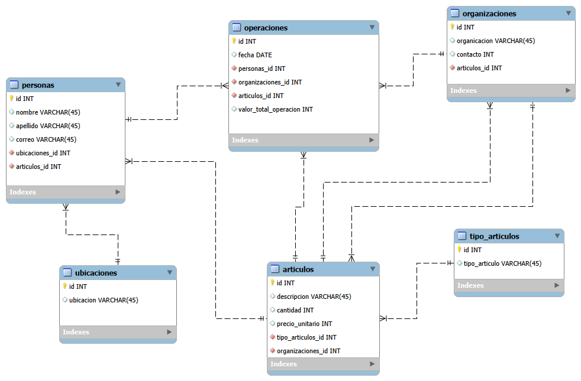

# Proceso de Normalización de Base de Datos

## Tabla #1 Original (Fuente en Excel)

La siguiente tabla representa la información inicial sin normalización.  
Contiene datos redundantes y posibles anomalías de actualización.

### Estructura Original

| Estudiante_ID | Nombre_Estudiante | Correo_Estudiante | Curso_ID | Nombre_Curso     | Profesor_Curso |
|--------------|-------------------|-------------------|----------|------------------|----------------|
| 1            | Ana Torres        | ana@email.com     | 101      | Bases de Datos   | Carlos Pérez  |
| 1            | Ana Torres        | ana@email.com     | 102      | Programación I   | Laura Gómez   |
| 2            | Luis Martínez     | luis@email.com    | 101      | Bases de Datos   | Carlos Pérez  |
| 3            | Sofía Ramírez     | sofia@email.com   | 103      | Algoritmos       | Miguel Castro |
| 2            | Luis Martínez     | luis@email.com    | 103      | Algoritmos       | Miguel Castro |
| 3            | Sofía Ramírez     | sofia@email.com   | 101      | Bases de Datos   | Carlos Pérez  |

---

### Problemas Detectados

- **Redundancia de datos**:
  - El nombre y correo del estudiante se repiten múltiples veces.
  - El nombre del curso y profesor también se repiten.

- **Anomalías potenciales**:
  - Si cambia el correo del estudiante, debe actualizarse en múltiples registros.
  - Si cambia el profesor de un curso, se deben modificar varias filas.
  - No es posible registrar un nuevo curso sin asignarlo a un estudiante.

---

## Proceso de Normalización

Se aplicó normalización hasta **Tercera Forma Normal (3FN)** con el objetivo de:

- Eliminar redundancia.
- Separar entidades independientes.
- Garantizar integridad referencial.
- Optimizar el almacenamiento y mantenimiento.

---

## Modelo Normalizado

Este es el modelo resultante al dividir las tablas:

---

El modelo resultante se divide en las siguientes tablas:

### Tabla: `estudiantes`

| Campo               | Tipo         | Descripción |
|---------------------|-------------|-------------|
| id                  | INT (PK)    | Identificador único del estudiante |
| nombre              | VARCHAR(45) | Nombre del estudiante |
| apellido            | VARCHAR(45) | Apellido del estudiante |
| correo              | VARCHAR(45) | Correo electrónico |
| tipo_documentos_id  | INT (FK)    | Referencia a tipo_documentos |

---

### Tabla: `profesores`

| Campo               | Tipo         | Descripción |
|---------------------|-------------|-------------|
| id                  | INT (PK)    | Identificador único del profesor |
| nombre              | VARCHAR(45) | Nombre del profesor |
| apellido            | VARCHAR(45) | Apellido del profesor |
| correo              | VARCHAR(45) | Correo electrónico |
| tipo_documentos_id  | INT (FK)    | Referencia a tipo_documentos |

---

### Tabla: `cursos`

| Campo | Tipo | Descripción |
|-------|------|-------------|
| id    | INT (PK) | Identificador único del curso |
| curso | VARCHAR(45) | Nombre del curso |

---

### Tabla: `tipo_documentos`

| Campo           | Tipo         | Descripción |
|-----------------|-------------|-------------|
| id              | INT (PK)    | Identificador único |
| tipo_documento  | VARCHAR(45) | Tipo de documento |

---

### Tabla: `union_cursos`

Tabla intermedia que resuelve la relación **Muchos a Muchos** entre estudiantes, profesores y cursos.

| Campo           | Tipo      | Descripción |
|-----------------|----------|-------------|
| id              | INT (PK) | Identificador único |
| cursos_id       | INT (FK) | Referencia a cursos |
| profesores_id   | INT (FK) | Referencia a profesores |
| estudiantes_id  | INT (FK) | Referencia a estudiantes |

---

## Relación entre Tablas

- Un **estudiante** puede estar inscrito en varios cursos.
- Un **curso** puede tener varios estudiantes.
- Un **curso** es dictado por un profesor.
- La tabla `union_cursos` permite gestionar la matrícula de estudiantes en cursos específicos con su respectivo profesor.

---

## Beneficios de la Normalización

- Eliminación de redundancia.
- Integridad referencial mediante claves foráneas.
- Reducción de inconsistencias.
- Escalabilidad del modelo.
- Mayor claridad estructural.
- Mejora en el rendimiento de consultas estructuradas.

---

## Conclusión

La normalización permitió transformar una tabla con redundancia y riesgo de inconsistencias en un modelo relacional estructurado, escalable y alineado con buenas prácticas de diseño de bases de datos.  
El modelo final cumple con la **Tercera Forma Normal (3FN)**, asegurando que cada entidad almacene únicamente información dependiente de su clave primaria.

---

## Proceso de Normalización – Caso 2 (Universidades, Cursos y Semestres)

### Tabla #2 Original (Fuente en Excel)

La siguiente tabla representa la estructura inicial sin normalización.  
Integra información de estudiantes, universidad, cursos, profesores y semestre en una sola tabla.

### Estructura Original

Imagen:

---

Estructura:

| Estudiante_ID | Nombre_Estudiante | Correo_Estudiante | Universidad            | Ciudad_Universidad | Curso_ID | Nombre_Curso     | Profesor        | Correo_Profesor  | Semestre |
|--------------|------------------|------------------|------------------------|-------------------|----------|------------------|----------------|------------------|----------|
| 1 | Ana Torres      | ana@email.com    | Universidad Central     | Medellín    | 101 | Bases de Datos   | Carlos Pérez  | carlos@uni.edu | 2026-1 |
| 1 | Ana Torres      | ana@email.com    | Universidad Central     | Medellín    | 102 | Programación I   | Laura Gómez   | laura@uni.edu  | 2026-1 |
| 2 | Luis Martínez   | luis@email.com   | Universidad Central     | Medellín    | 101 | Bases de Datos   | Carlos Pérez  | carlos@uni.edu | 2026-1 |
| 3 | Sofía Ramírez   | sofia@email.com  | Universidad del Norte   | Barranquilla | 103 | Algoritmos       | Miguel Castro | miguel@uni.edu | 2026-1 |
| 2 | Luis Martínez   | luis@email.com   | Universidad Central     | Medellín    | 103 | Algoritmos       | Miguel Castro | miguel@uni.edu | 2026-2 |
| 4 | Daniel Rojas    | daniel@email.com | Universidad del Norte   | Barranquilla | 101 | Bases de Datos   | Carlos Pérez  | carlos@uni.edu | 2026-2 |

---

## Problemas Detectados

### Redundancia de Información

- Los datos del estudiante se repiten en cada curso inscrito.
- El nombre de la universidad y ciudad se duplican múltiples veces.
- El nombre y correo del profesor se repiten en cada registro.
- El semestre se repite para múltiples estudiantes y cursos.

### Anomalías Potenciales

- Cambio de correo del profesor implica múltiples actualizaciones.
- Cambio de nombre de universidad requiere modificar varias filas.
- No se puede registrar un nuevo semestre o universidad sin asociarlo a un estudiante.
- Alta probabilidad de inconsistencias en datos repetidos.

---

## Proceso de Normalización

Se aplicó normalización hasta **Tercera Forma Normal (3FN)** con los siguientes objetivos:

- Separar entidades independientes.
- Eliminar dependencias transitivas.
- Garantizar integridad referencial.
- Optimizar el modelo relacional.

---

## Modelo Normalizado

El modelo final se estructura en entidades independientes relacionadas mediante claves foráneas.

Imagen:

---

### Tabla: `estudiantes`

| Campo            | Tipo         | Descripción |
|------------------|-------------|-------------|
| id               | INT (PK)    | Identificador único del estudiante |
| nombre           | VARCHAR(45) | Nombre del estudiante |
| apellido         | VARCHAR(45) | Apellido del estudiante |
| correo           | VARCHAR(45) | Correo electrónico |
| universidades_id | INT (FK)    | Referencia a universidades |
| cursos_id        | INT (FK)    | Referencia a cursos |
| semestres_id     | INT (FK)    | Referencia a semestres |

---

### Tabla: `universidades`

| Campo  | Tipo         | Descripción |
|--------|-------------|-------------|
| id     | INT (PK)    | Identificador único |
| nombre | VARCHAR(45) | Nombre de la universidad |
| ciudad | VARCHAR(45) | Ciudad donde se ubica |

---

### Tabla: `profesores`

| Campo            | Tipo         | Descripción |
|------------------|-------------|-------------|
| id               | INT (PK)    | Identificador único |
| nombre           | VARCHAR(45) | Nombre del profesor |
| apellido         | VARCHAR(45) | Apellido del profesor |
| correo           | VARCHAR(45) | Correo electrónico |
| universidades_id | INT (FK)    | Universidad asociada |
| cursos_id        | INT (FK)    | Curso que dicta |
| semestres_id     | INT (FK)    | Semestre asignado |

---

### Tabla: `cursos`

| Campo  | Tipo         | Descripción |
|--------|-------------|-------------|
| id     | INT (PK)    | Identificador único |
| nombre | VARCHAR(45) | Nombre del curso |

---

### Tabla: `semestres`

| Campo     | Tipo         | Descripción |
|-----------|-------------|-------------|
| id        | INT (PK)    | Identificador único |
| semestre  | VARCHAR(45) | Periodo académico |

---

### Tabla: `union_cursos`

Tabla intermedia que consolida la relación entre:

- Estudiantes  
- Profesores  
- Cursos  
- Universidades  
- Semestres  

| Campo            | Tipo      | Descripción |
|------------------|----------|-------------|
| id               | INT (PK) | Identificador único |
| cursos_id        | INT (FK) | Referencia a cursos |
| universidades_id | INT (FK) | Referencia a universidades |
| estudiantes_id   | INT (FK) | Referencia a estudiantes |
| profesores_id    | INT (FK) | Referencia a profesores |
| semestres_id     | INT (FK) | Referencia a semestres |

---

## Relaciones del Modelo

- Un estudiante pertenece a una universidad.
- Un profesor pertenece a una universidad.
- Un estudiante puede inscribirse en múltiples cursos.
- Un curso puede ser dictado por un profesor.
- Un curso se ofrece en un semestre determinado.
- La tabla `union_cursos` gestiona las relaciones múltiples entre las entidades.

---

## Beneficios de la Normalización

- Eliminación de redundancia estructural.
- Control de integridad mediante claves foráneas.
- Reducción de anomalías de actualización.
- Mayor escalabilidad del modelo.
- Separación clara de responsabilidades por entidad.
- Mejor rendimiento en consultas relacionales.

---

## Conclusión

La transformación de la tabla original en un modelo relacional normalizado permitió estructurar la información académica en entidades independientes y relacionadas mediante integridad referencial.  

El modelo final cumple con la **Tercera Forma Normal (3FN)**, asegurando que cada tabla almacene únicamente datos dependientes de su clave primaria, eliminando dependencias transitivas y redundancias innecesarias.

---

## Proceso de Normalización – Caso 3 (Sistema de Pedidos)

### Tabla #3 Original (Fuente en Excel)

La siguiente tabla corresponde al modelo inicial sin normalización.  
En ella se integran datos de pedidos, clientes, productos, categorías, proveedores y ciudades en una sola estructura.

### Estructura Original

| Pedido_ID | Fecha_Pedido | Cliente_ID | Nombre_Cliente | Correo_Cliente | Ciudad_Cliente | Producto_ID | Nombre_Producto | Categoria_Producto | Proveedor      | Telefono_Proveedor | Cantidad | Precio_Unitario | Total_Pedido |
|------------|-------------|------------|----------------|----------------|----------------|------------|----------------|--------------------|---------------|--------------------|----------|-----------------|--------------|
| 1001 | 2026-02-01 | 1 | Andrés López | andres@email.com | Medellín | 501 | Laptop Gamer | Computadores | TechSupplier | 3001234567 | 1 | 4500000 | 4500000 |
| 1001 | 2026-02-01 | 1 | Andrés López | andres@email.com | Medellín | 502 | Mouse RGB | Accesorios | AccesCorp | 3009876543 | 2 | 50000 | 4550000 |
| 1002 | 2026-02-03 | 2 | Laura Gómez | laura@email.com | Bogotá | 503 | Teclado Mecánico | Accesorios | AccesCorp | 3009876543 | 1 | 250000 | 250000 |
| 1003 | 2026-02-05 | 3 | Carlos Ramírez | carlos@email.com | Cali | 501 | Laptop Gamer | Computadores | TechSupplier | 3001234567 | 1 | 4400000 | 4400000 |
| 1004 | 2026-02-06 | 1 | Andrés López | andres@email.com | Medellín | 504 | Monitor 27 pulgadas | Monitores | DisplayWorld | 3011112233 | 1 | 900000 | 900000 |
| 1004 | 2026-02-06 | 1 | Andrés López | andres@email.com | Medellín | 502 | Mouse RGB | Accesorios | AccesCorp | 3009876543 | 1 | 50000 | 900000 |

---

### Imagen de la Tabla Original

---

## 2. Problemas Detectados

### 2.1 Redundancia de Datos

- Información del cliente repetida en cada pedido.
- Datos del proveedor duplicados múltiples veces.
- Categoría del producto repetida en cada registro.
- Ciudad del cliente almacenada como texto repetitivo.
- Precio unitario repetido en cada pedido.

### 2.2 Anomalías Potenciales

- Cambio de teléfono del proveedor requiere múltiples actualizaciones.
- Cambio de ciudad del cliente implica modificar varios registros.
- No se puede registrar un producto sin asociarlo a un pedido.
- Riesgo de inconsistencias en totales de pedidos.

---

## 3. Proceso de Normalización

Se aplicó normalización hasta Tercera Forma Normal (3FN) con los siguientes objetivos:

- Separar entidades independientes.
- Eliminar dependencias transitivas.
- Garantizar integridad referencial.
- Optimizar mantenimiento y escalabilidad.

---

## 4. Modelo Normalizado

El modelo final divide la información en entidades independientes relacionadas mediante claves foráneas.

---

### Tabla: clientes

| Campo | Tipo | Descripción |
|--------|------|------------|
| id | INT (PK) | Identificador único del cliente |
| nombre | VARCHAR(45) | Nombre del cliente |
| apellido | VARCHAR(45) | Apellido del cliente |
| correo | VARCHAR(45) | Correo electrónico |
| ciudades_id | INT (FK) | Referencia a ciudades |

---

### Tabla: ciudades

| Campo | Tipo | Descripción |
|--------|------|------------|
| id | INT (PK) | Identificador único |
| ciudad | VARCHAR(45) | Nombre de la ciudad |

---

### Tabla: categorias

| Campo | Tipo | Descripción |
|--------|------|------------|
| id | INT (PK) | Identificador único |
| categoria | VARCHAR(45) | Nombre de la categoría |

---

### Tabla: proveedores

| Campo | Tipo | Descripción |
|--------|------|------------|
| id | INT (PK) | Identificador único |
| proveedor | VARCHAR(45) | Nombre del proveedor |
| telefono | INT | Número de contacto |
| ciudades_id | INT (FK) | Ciudad asociada |

---

### Tabla: productos

| Campo | Tipo | Descripción |
|--------|------|------------|
| id | INT (PK) | Identificador único |
| nombre | VARCHAR(45) | Nombre del producto |
| cantidad | INT | Cantidad disponible |
| precio_unitario | INT | Precio del producto |
| categorias_id | INT (FK) | Categoría asociada |
| proveedores_id | INT (FK) | Proveedor asociado |

---

### Tabla: pedidos

| Campo | Tipo | Descripción |
|--------|------|------------|
| id | INT (PK) | Identificador único del pedido |
| fecha | DATE | Fecha del pedido |
| clientes_id | INT (FK) | Cliente asociado |
| proveedores_id | INT (FK) | Proveedor asociado |
| productos_id | INT (FK) | Producto asociado |
| precio_final | INT | Total del pedido |

---

### Imagen del Modelo Normalizado

---

## 5. Relaciones del Modelo

- Un cliente pertenece a una ciudad.
- Un proveedor pertenece a una ciudad.
- Un producto pertenece a una categoría.
- Un producto es suministrado por un proveedor.
- Un pedido está asociado a un cliente.
- Un pedido referencia productos y proveedores mediante claves foráneas.

---

## 6. Beneficios de la Normalización

- Eliminación de redundancia estructural.
- Integridad referencial mediante claves foráneas.
- Reducción de inconsistencias.
- Mejor organización lógica de la información.
- Mayor eficiencia en consultas y mantenimiento.
- Escalabilidad del sistema.

---

## 7. Conclusión

La normalización permitió transformar una tabla con múltiples dependencias y redundancias en un modelo relacional estructurado.  
El diseño final cumple con la Tercera Forma Normal (3FN), garantizando que cada entidad almacene únicamente inf

---

## Proceso de Normalización – Caso 4 (Operaciones y Artículos)

### Tabla #4 Original (Fuente en Excel)

La siguiente tabla representa el modelo inicial sin normalización.  
En ella se integran datos de operaciones, personas, ubicaciones, artículos, tipo de artículo y organizaciones en una sola estructura.

### Estructura Original

| ref_operacion | fecha_operacion | id_persona | persona | email | ubicacion | id_articulo | descripcion_articulo | tipo_articulo | organizacion | contacto_org | cantidad | precio_unit | valor_total_operacion |
|---------------|----------------|------------|----------|--------|-----------|-------------|----------------------|---------------|--------------|--------------|----------|-------------|------------------------|
| 5001 | 2026-04-01 | 21 | Camila Torres | camila@email.com | Medellín | 801 | Portátil X15 | Cómputo | GlobalTech | 3201112233 | 1 | 3800000 | 3950000 |
| 5001 | 2026-04-01 | 21 | Camila Torres | camila@email.com | Medellín | 802 | Mouse inalámbrico | Periféricos | AccesoriosPlus | 3009998877 | 1 | 150000 | 3950000 |
| 5002 | 2026-04-02 | 22 | Julián Herrera | julian@email.com | Bogotá | 803 | Monitor 24 | Pantallas | DisplayPro | 3012223344 | 2 | 700000 | 1400000 |
| 5003 | 2026-04-03 | 23 | Natalia Ríos | natalia@email.com | Cali | 801 | Portátil X15 | Cómputo | GlobalTech | 3201112233 | 1 | 3700000 | 3700000 |
| 5004 | 2026-04-04 | 21 | Camila Torres | camila@email.com | Medellín | 804 | Audífonos Studio | Audio | SoundGroup | 3154445566 | 1 | 600000 | 600000 |
| 5004 | 2026-04-04 | 21 | Camila Torres | camila@email.com | Medellín | 802 | Mouse inalámbrico | Periféricos | AccesoriosPlus | 3009998877 | 1 | 150000 | 600000 |

---

### Imagen de la Tabla Original

---

## 2. Problemas Detectados

### 2.1 Redundancia de Información

- Datos de la persona repetidos en cada operación.
- Ubicación almacenada como texto repetitivo.
- Información de la organización duplicada múltiples veces.
- Tipo de artículo repetido en cada registro.
- Precio unitario repetido en cada operación.

### 2.2 Anomalías Potenciales

- Cambio de correo de la persona implica múltiples actualizaciones.
- Cambio de contacto de la organización requiere modificar varios registros.
- No se puede registrar un artículo sin asociarlo a una operación.
- Riesgo de inconsistencias en el valor total de la operación.

---

## 3. Proceso de Normalización

Se aplicó normalización hasta Tercera Forma Normal (3FN) con los siguientes objetivos:

- Separar entidades independientes.
- Eliminar dependencias parciales y transitivas.
- Garantizar integridad referencial.
- Optimizar consistencia y escalabilidad del modelo.

---

## 4. Modelo Normalizado

El modelo final divide la información en entidades independientes relacionadas mediante claves foráneas.

---

### Tabla: personas

| Campo | Tipo | Descripción |
|--------|------|------------|
| id | INT (PK) | Identificador único |
| nombre | VARCHAR(45) | Nombre |
| apellido | VARCHAR(45) | Apellido |
| correo | VARCHAR(45) | Correo electrónico |
| ubicaciones_id | INT (FK) | Referencia a ubicaciones |

---

### Tabla: ubicaciones

| Campo | Tipo | Descripción |
|--------|------|------------|
| id | INT (PK) | Identificador único |
| ubicacion | VARCHAR(45) | Ciudad o ubicación |

---

### Tabla: tipo_articulos

| Campo | Tipo | Descripción |
|--------|------|------------|
| id | INT (PK) | Identificador único |
| tipo_articulo | VARCHAR(45) | Tipo de artículo |

---

### Tabla: organizaciones

| Campo | Tipo | Descripción |
|--------|------|------------|
| id | INT (PK) | Identificador único |
| organizacion | VARCHAR(45) | Nombre de la organización |
| contacto | INT | Número de contacto |

---

### Tabla: articulos

| Campo | Tipo | Descripción |
|--------|------|------------|
| id | INT (PK) | Identificador único |
| descripcion | VARCHAR(45) | Descripción del artículo |
| cantidad | INT | Cantidad disponible |
| precio_unitario | INT | Precio unitario |
| tipo_articulos_id | INT (FK) | Tipo de artículo asociado |
| organizaciones_id | INT (FK) | Organización asociada |

---

### Tabla: operaciones

| Campo | Tipo | Descripción |
|--------|------|------------|
| id | INT (PK) | Identificador único |
| fecha | DATE | Fecha de la operación |
| personas_id | INT (FK) | Persona asociada |
| organizaciones_id | INT (FK) | Organización asociada |
| articulos_id | INT (FK) | Artículo asociado |
| valor_total_operacion | INT | Valor total de la operación |

---

### Imagen del Modelo Normalizado

---

## 5. Relaciones del Modelo

- Una persona pertenece a una ubicación.
- Un artículo pertenece a un tipo de artículo.
- Un artículo está asociado a una organización.
- Una operación está asociada a una persona.
- Una operación referencia artículos y organizaciones mediante claves foráneas.
- La integridad del modelo se mantiene mediante claves primarias y foráneas.

---

## 6. Beneficios del Modelo Normalizado

- Eliminación de redundancia estructural.
- Separación clara de responsabilidades por entidad.
- Reducción de anomalías de actualización.
- Mayor control de integridad referencial.
- Optimización del mantenimiento y escalabilidad del sistema.

---

## 7. Consideración Final del Caso

El presente caso corresponde al último ejercicio de normalización documentado en este informe.  

La evolución desde una tabla plana con múltiples dependencias hacia un modelo relacional estructurado evidencia la aplicación sistemática de principios de diseño en bases de datos.  

En todos los casos desarrollados se aplicó Tercera Forma Normal (3FN), garantizando consistencia, integridad y eficiencia en la gestión de la información.
